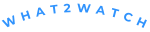

<h1 align='center'>What 2 watch</h1>

A responsive streaming website.

<a href='https://what2watch-mauve.vercel.app/'><strong>Go watch a movie</strong></a> .
<a href='#tech-stack'><strong>Tech Stack</strong></a> .
<a href='#author'><strong>Author</strong></a>

 

## Tech Stack

- [Next.js](https://nextjs.org) Framework
- [Typescript](https://www.typescriptlang.org) Language
- [shadcn/ui](https://ui.shadcn.com)
  - Styling with [Tailwind CSS](https://tailwindcss.com)
  - Icons from [React Icons](https://react-icons.github.io/react-icons)
- Good practice with [ESlint](https://eslint.org)
- Deployed with [Vercel](https://vercel.com/)
- Designed with [Figma](https://www.figma.com/)

## Author

- My self ([@vitolinho](https://github.com/vitolinho))